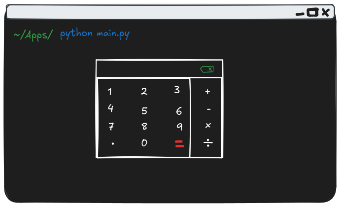

# Shell Calc

A calculator served in terminal user interface

## 💡Idea

- Simple calculator with addition, substrction, multiplication & division

- Use [Textual](https://github.com/textualize/textual) as the base library
